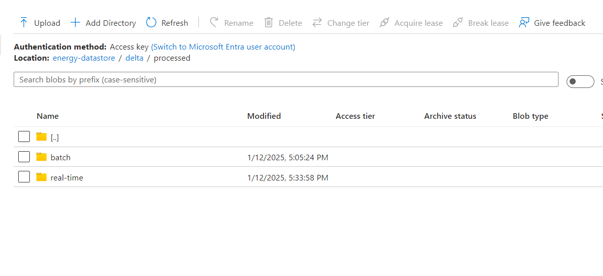

# Renewable Energy Monitoring Lakehouse with Azure Synapse and Delta Lake

## Overview
The goal of this project is to build a modern lakehouse architecture to process, store, and analyze renewable energy data. The system is designed to ingest data from multiple sources, process it using Azure Synapse Analytics and Delta Lake, and store it in Azure Data Lake Storage

## High-Level Architecture

**Data Sources:** 

- Real-Time Data: Energy consumption and production data ingested via API.
- Batch Data: Historical energy datasets stored in CSV files.

**Data Ingestion:**

-   Azure Blob Storage / ADLS Gen2: Serves as a landing zone for both real-time and batch data before further processing.
  
**Data Storage:**

-   Azure Data Lake Storage Gen2 (ADLS): Stores raw, processed, and data in a structured format for easy access and scalability.

- Delta Lake: Adds transactional reliability to the data stored in ADLS. Supports ACID operations, version control, and time travel for analytical consistency..
  
**Data Processing:**

-   Azure Databricks: Handles real-time and batch data transformations.

**Data Insights**:

-  Azure Synapse Studio: Facilitates creation of data views for ad-hoc analysis and reporting.

**End Users:**

Data scientists, analysts, and decision-makers can access insights via BI tools or dashboards.

## Project Workflow

- **Data Sources → ADLS (Raw Zone) :**
    -   Raw data from real-time and batch is ingested into Azure Data Lake Storage Gen2 in the Raw Zone.

    

-   **Delta Lake (Raw Data Storage):**
    -   Raw data is stored in Delta Lake for reliability, versioning, and easy accessibility.
    
    

-   **Processing (Databricks) → Delta Lake (Processed Zone):**

    -   Data is cleaned, transformed, and aggregated in Azure Databricks. Processed data is stored back into Delta Lake in the Processed Zone with optimized partitioning for analytics.
    
    

- **Analytics (Synapse Analytics):**

    -   Azure Synapse Analytics connects to the Processed Zone of Delta Lake, enabling SQL-based querying, advanced analytics, and data preparation for reporting.
    
    

-   **Visualization (Power BI or Synapse Studio)**
    -   Insights and trends are visualized using Power BI dashboards or quick visualizations in Synapse Studio for decision-making.

This workflow ensures a streamlined approach from data ingestion to actionable insights, leveraging the power of Azure's ecosystem.

